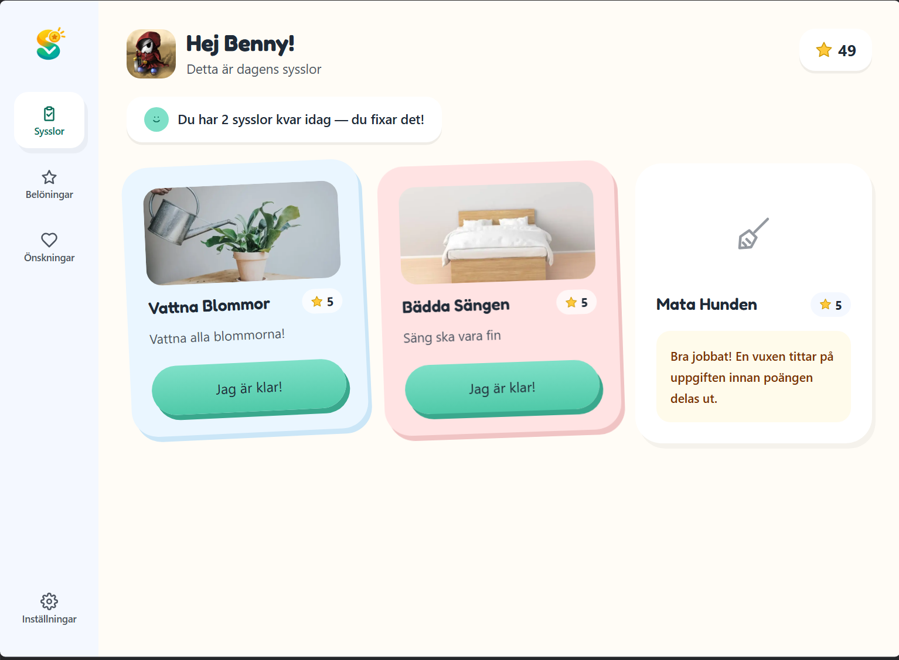
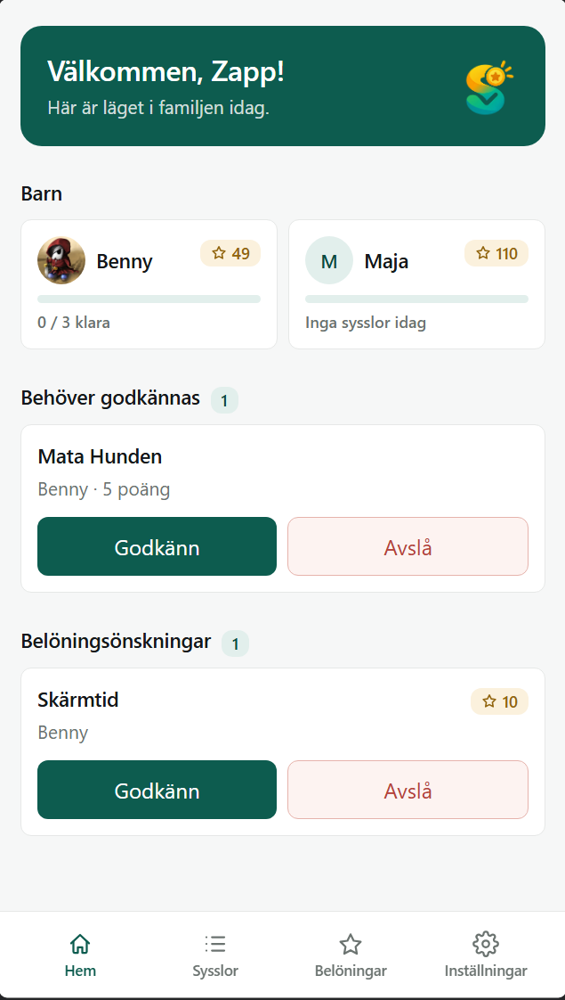
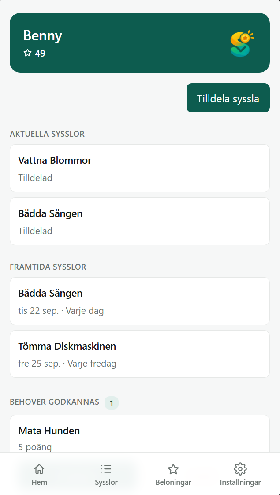

# Sysslo

> En familjeapp för att dela ut, följa upp och belöna sysslor i hemmet.

[](https://github.com/DennisCederqvist/Syssloappen/actions/workflows/ci.yml)

**Live: [sysslo.dxcode.se](https://sysslo.dxcode.se)** · English: [README.md](README.md)

Sysslo är en webbapp där föräldrar skapar sysslor och delar ut dem till barnen. Barnen öppnar appen på sin egen surfplatta eller telefon, ser vad de ska göra idag och bockar av. De vuxna godkänner arbetet, barnen tjänar poäng, och poängen kan användas till belöningar som familjen själv bestämmer.

**Vuxna administrerar. Barn utför. Alla ser rätt information.**

## Skärmdumpar

<p align="center">
  
</p>
<p align="center"><em>Barnets vy, på en surfplatta.</em></p>

<table align="center">
  <tr>
    <td align="center" valign="top">
      
    </td>
    <td align="center" valign="top">
      
    </td>
  </tr>
  <tr>
    <td align="center"><em>Vuxnas startsida, på en telefon.</em></td>
    <td align="center"><em>Ett barns profil, med framtida sysslor.</em></td>
  </tr>
</table>

## Funktioner

**För vuxna**

- Skapa en familj (ett *household*), bjud in en andra vuxen med en engångskod och hantera vem som ingår.
- Lägg till barn, var och en med egen inloggning. Koppla ett barns enhet med en engångskod eller genom att skanna en QR-kod. Familjekod plus barnets namn och lösenord fungerar som reservväg.
- Håll en bank av återanvändbara sysslor med fritt poängvärde och valfri bild.
- Dela ut en syssla för ett visst datum, en gång eller enligt ett schema: varje dag, varje vecka, varje månad eller på valda veckodagar. Missade återkommande sysslor följer med tills nästa tillfälle och ersätts då, så de hopar sig aldrig.
- Ändra en syssla datum eller schema i efterhand, och se kommande sysslor som barnet ännu inte kan se.
- Godkänn en klar syssla, eller skicka tillbaka den för att göras om, med en kommentar.
- Se varje barns nuvarande poäng på startsidan och på barnets profil.
- Skapa en belöningskatalog med lagersaldo och bilder. Godkänn, avslå eller markera önskade belöningar som utlämnade.
- Bläddra i en historik över klara sysslor och belöningar.

**För barn**

- En enkel, lekfull vy över dagens sysslor, utan något annat att gå vilse i.
- Rapportera en syssla som klar, se när den ska göras om och följ hur poängen växer.
- Bläddra bland familjens belöningar och önska en. Poängen reserveras tills en vuxen har svarat.
- Nya sysslor och svar dyker upp direkt, utan att sidan laddas om. Pushnotiser kan aktiveras för när appen är stängd.

**För hela familjen**

- Kan installeras som en app på telefoner och surfplattor (PWA).
- Svenska och engelska, går att byta när som helst.
- Responsiv och granskad för tillgänglighet.
- E-postbekräftelse, lösenordsåterställning och möjlighet att radera familjen och all dess data permanent (GDPR).

## Använda appen

1. **Skapa en familj.** Öppna [sysslo.dxcode.se](https://sysslo.dxcode.se), välj *Skapa konto* och bekräfta din e-postadress. Spara familjekoden du får se, den visas bara en gång.
2. **Lägg till ett barn.** Gå till *Inställningar → Barn och konton*, lägg till barnet och välj ett namn och ett lösenord.
3. **Koppla barnets enhet.** Tryck på *Koppla enhet* på barnet. Öppna inloggningssidan på barnets surfplatta, välj *Barn* och skriv in engångskoden (eller skanna QR-koden).
4. **Skapa och dela ut en syssla.** Skapa en syssla under *Sysslor* och tryck på *Tilldela*. Välj barn, datum och eventuellt ett schema.
5. **Följ upp.** När barnet rapporterar en syssla som klar dyker den upp på startsidan. Godkänn den för att ge poängen.

### Installera som app

- **iPhone / iPad (Safari):** tryck på Dela-ikonen och välj *Lägg till på hemskärmen*.
- **Android (Chrome):** öppna menyn (tre punkter) och välj *Installera app*.

Samma instruktioner finns i appens hjälpsida.

## Hur den är byggd

| | |
| --- | --- |
| **Frontend** | Angular 22, TypeScript, Tailwind CSS 4, Transloco (i18n), service worker (PWA) |
| **Backend** | C#, ASP.NET Core (.NET 10), Entity Framework Core, ASP.NET Core Identity, SignalR |
| **Databas** | PostgreSQL (Supabase i produktion) |
| **Övrigt** | Resend (e-post), Web Push med VAPID, Supabase Storage eller lokal disk för bilder |
| **Drift** | Render (en Docker-image som serverar både API och app), GitHub Actions för CI |

```text
┌──────────────────────────┐
│     Angular (PWA)        │   telefon / surfplatta / dator
└────────────┬─────────────┘
             │  HTTPS: JSON + SignalR (liveuppdateringar)
             ▼
┌──────────────────────────┐
│    ASP.NET Core API      │   inloggning, behörighet, affärsregler,
│                          │   household-isolering, notiser
└────────────┬─────────────┘
             │  Entity Framework Core
             ▼
┌──────────────────────────┐
│       PostgreSQL         │
└──────────────────────────┘
```

I produktion serverar API:t också den byggda Angular-appen, så de delar samma ursprung och behöver varken CORS eller cookies över domäner.

### Den viktigaste regeln: household-isolering

Allt tillhör ett **household**, och en användare får aldrig kunna nå ett annat hushålls data, inte ens genom att anropa API:t direkt. Varje databasfråga kombinerar det efterfrågade id:t med den inloggade användarens hushåll, och testerna kontrollerar det. Några andra val som följer av samma noggrannhet:

- Engångskoder (enhetskoppling, inbjudningar) är slumpmässiga, kortlivade, kan bara användas en gång, och bara deras hash lagras.
- Bekräftelse- och återställningslänkar byggs från en konfigurerad bas-URL, aldrig från förfrågans Host-header.
- Row Level Security är aktiverat på varje tabell, så databasens publika API exponerar ingenting.
- Belöningspoäng reserveras atomärt, så poäng inte kan spenderas två gånger.

## Kör den lokalt

Du behöver **.NET 10 SDK**, **Node.js 22** med npm och en lokal **PostgreSQL**.

```bash
# 1. Backend: peka ut databasen, kör migreringarna och starta API:t
cd backend/Syssloappen.Api
dotnet user-secrets set "ConnectionStrings:SyssloappenDatabase" "Host=localhost;Port=5432;Database=syssloappen_dev;Username=postgres;Password=DITT_LÖSENORD"
dotnet tool restore
dotnet ef database update
dotnet run --launch-profile http        # http://localhost:5047

# 2. Frontend (i en andra terminal)
cd frontend
npm ci
npm start                               # http://localhost:4200, skickar /api och /hubs vidare till API:t
```

- Starta om API:t efter varje backendändring, `dotnet run` laddar inte om koden. Kör `dotnet ef database update` igen när du hämtat nya migreringar.
- Utan en konfigurerad e-postleverantör skrivs bekräftelse- och återställningslänkar ut i API:ts konsol i stället för att skickas.

### Konfiguration

Sätt dem med `dotnet user-secrets` lokalt, eller som miljövariabler (`Sektion__Nyckel`) vid driftsättning. Alla är valfria utom anslutningssträngen.

| Nyckel | Syfte |
| --- | --- |
| `ConnectionStrings:SyssloappenDatabase` | PostgreSQL-anslutningssträng (obligatorisk) |
| `PublicBaseUrl` | Bas-URL i länkar som skickas med e-post (sätts i `appsettings*.json`) |
| `Email:Provider` = `Resend`, `Email:Resend:ApiKey` | Skicka riktig e-post i stället för att logga den |
| `Storage:Provider` = `Supabase`, `Storage:Supabase:{Url,ServiceKey,Bucket}` | Lagra bilder i Supabase i stället för på lokal disk |
| `WebPush:PublicKey`, `WebPush:PrivateKey`, `WebPush:Subject` | Aktivera pushnotiser (ett VAPID-nyckelpar) |

### Tester

```bash
dotnet test backend/Syssloappen.Api.Tests      # ~250 integrationstester, SQLite i minnet, ingen databas behövs
cd frontend && npx ng test --watch=false       # enhetstester
cd frontend && npm run e2e                     # webbläsartester (Playwright), kräver att API:t och en databas kör
```

CI kör backend- och frontendtesterna vid varje push och pull request.

### Driftsättning

Dockerfilen bygger frontend och API till en enda image. Bygg den från repots rot:

```bash
docker build -f backend/Syssloappen.Api/Dockerfile -t syssloappen-api .
```

Ge den konfigurationen ovan som miljövariabler. Migreringar körs inte automatiskt. Kör `dotnet ef database update` mot produktionsdatabasen när en release lägger till en.

## Projektstruktur

```text
backend/
  Syssloappen.Api/          ASP.NET Core API: controllers, modeller, migreringar, tjänster, SignalR-hub
  Syssloappen.Api.Tests/    integrationstester
frontend/
  src/app/features/adult/   vuxenvyerna
  src/app/features/child/   barnvyerna
  src/app/core/             inloggning, i18n, realtidsanslutning
  public/i18n/              svenska och engelska texter
docs/                       HANDOFF.md (teknisk status och beslut), designspecar
REQUIREMENTS.md             user stories och acceptanskriterier
```

- [`REQUIREMENTS.md`](REQUIREMENTS.md) är specifikationen: vad systemet ska göra, och vad som är klart.
- [`docs/HANDOFF.md`](docs/HANDOFF.md) är den tekniska statusen: beslut, fallgropar och vad som ändrats när.

## Status och vad som kommer

Allt i funktionslistan ovan är byggt och körs i produktion. Inte byggt, och inte planerat än: veckopeng, märken och prestationer, statistik, kalenderimport, "varannan vecka"-scheman, undantag för enskilda datum, offlineläge och en publik landningssida. Pushnotiser är implementerade men ska fortfarande verifieras på riktiga enheter i produktion.

## Om projektet

Sysslo började som ett lärprojekt, ett sätt att bygga något på riktigt från början till slut med en modern frontend, ett separat API, inloggning och en relationsdatabas. Det byggs fortfarande med det i åtanke: koden ska vara begriplig, och det ska vara tydligt *varför* något fungerar. På vägen har det vuxit till en fullt fungerande app.

Principerna det följer:

- **Enkelt för barn.** Ett barn ska kunna använda den utan instruktioner.
- **Tydliga roller.** Vuxna och barn har olika behov och olika vyer.
- **Backend äger säkerheten.** Frontend är aldrig den enda spärren mellan en användare och data de inte ska se.
- **Bygg det som behövs.** Kärnan först, sedan mer.

## Licens

[MIT](LICENSE) © 2026 Dennis Cederqvist
